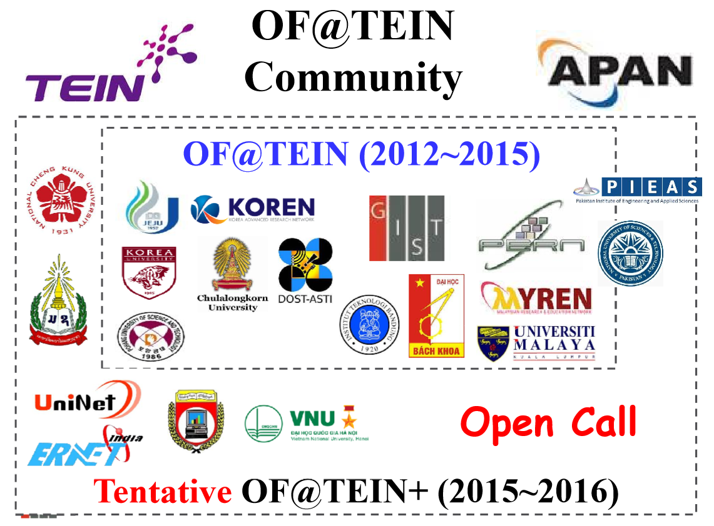
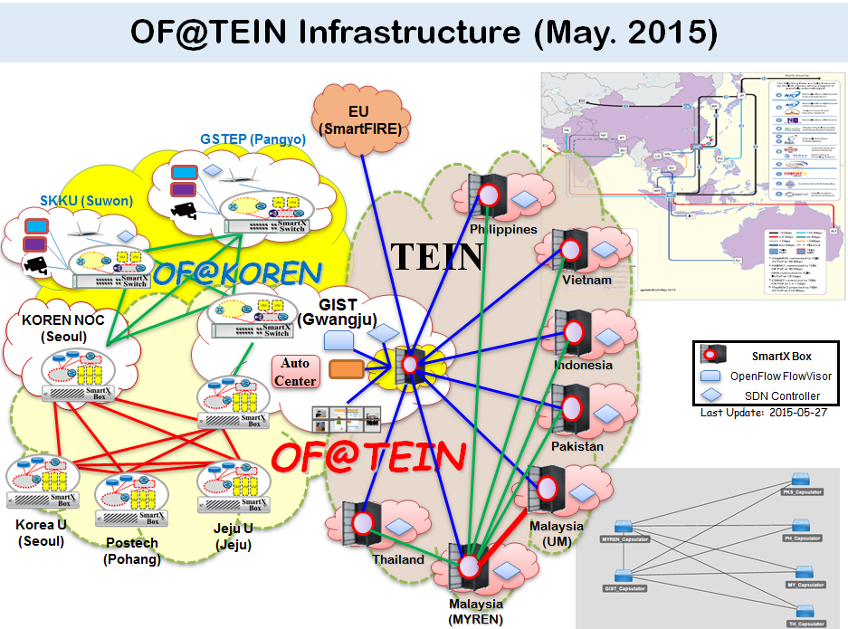

# OFTEIN 

##  **Introduction**

###  What is OF@TEIN?

OF@TEIN collaboration community was established to carry out “OF@TEIN: Toward an OpenFlow-enabled SDN (Software-Defined Networking) Infrastructure over TEIN” project. It was launched in July 2012 and led by Prof. JongWon Kim from NetCS (Networked Computing Systems) Laboratory, GIST (Gwangju Institute of Science & Technology), Korea. The main objective of OF@TEIN community collaboration was to deploy a shared OpenFlow-based SDN testbed infrastructure among Korea, South-East Asia and South Asia collaborators over TEIN4. In this OF@TEIN community collaboration, a unique hyper-convergent SmartX Box is designed and deployed in each site to promote the international SDN research collaboration over TEIN4 network infrastructure. Up to now, there are five kinds (Type A/B/B+/B*/C) of unique SmartX Boxes being built for physical/virtual nodes for OpenFlow Switches, Capsulators, and VM (virtual machine) Workers. By virtue of OF@TEIN community collaboration numerous success stories have been achieved till date.

In order to enhance and expend the OF@TEIN collaboration community, an OF@TEIN+ project team from 12 countries has been formed with the following goals to establish OF@TEIN+ Open Consortium (2015~2016) based on existing OF@TEIN collaborators (i.e., 7 countries) and recruiting new collaborators from other countries, provide the TEIN community with the opportunity to play (“Experience”) with a shared SDN-Cloud and DataFarm Playground and establish OF@TEIN operation/support team and tools to operate OF@TEIN Playground and provide technical guidance/training while addressing/solving several targeted technical challenges;

Following partners from existing OF@TEIN collaboration community will continue to participate in the proposed OF@TEIN+ project:

The overview diagram of OF@TEIN infrastructure, built through the collaborative effort of OF@TEIN partners, is depicted below:
 

## OF@TEIN Playground 

Please go to [OF@TEIN Playground](Playground/README.md) page to have an overview of the Playground.

## Software Solutions

Please go to [Ops-Software](Infrastructure_and_Visibility_Tools/README.md) page to see the working of developed operational software solutions.

## Project Workshops

Please go to [Workshops](Workshops/README.md) page to see the list of previous project meetings.

## Selected List of Publications

Please go to [Publications](Publications/OFTEIN_A_Community_Effort.pdf) page to see the selected list of publications.
